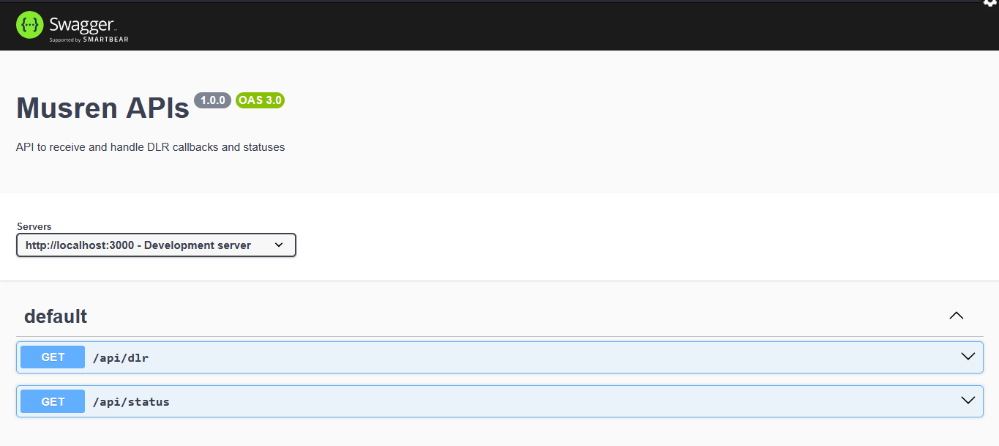

# musren_api
Musren API for recieving callbacks

## Dependencies Used

- "express": "^4.19.2",
- "nodemon": "^3.1.4",
- "swagger-jsdoc": "^6.2.8",
- "swagger-ui-express": "^5.0.1"

## PROJECT UI

| Section 1                                              |
| ------------------------------------------------------ |
|  |